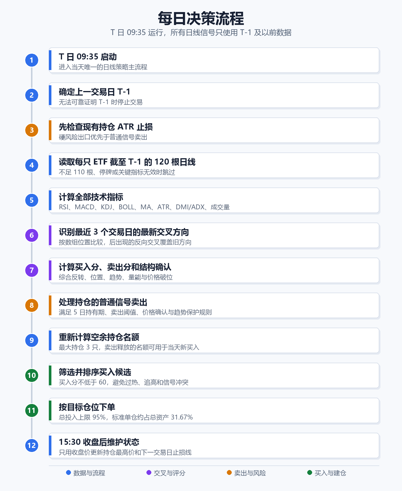

# 上穿下穿 ETF 策略详细说明

## 1. 文档信息

| 项目 | 内容 |
|---|---|
| 策略名称 | 上穿下穿 ETF 策略 |
| 正式版本 | `cross-v0.3.2` |
| 部署构建号 | `20260726.14` |
| 聚宽正式文件 | `smart_trade_joinquant_cross_signal_etf.py` |
| PTrade 正式文件 | `smart_trade_ptrade_cross_signal_etf.py` |
| 本地训练回放入口 | `local_training_run.py` |
| 信号级别 | 日线 |
| 信号时点 | T 日 09:35 使用 T-1 及以前的完整日线 |
| 最大持仓 | 3 只 ETF |
| 目标投入比例 | 组合资产的 95% |

本文以当前正式代码为唯一口径，解释已经冻结的业务逻辑、ETF 池、交易时序和主要风险。本文不是新的调参方案，也不改变任何交易行为。

## 2. 策略定位

这是一套以技术指标上穿、下穿为核心的日线级 ETF 交易策略。它试图在价格处于相对低位、反转信号开始形成且趋势得到一定确认时买入，在反转信号转弱并得到价格破位确认时卖出，同时使用 ATR 移动止损控制突发风险。

策略追求的是“相对低位确认后买入、相对高位转弱后卖出”，而不是预测绝对最低点和绝对最高点。技术指标本身存在滞后和假突破，因此策略没有采用“出现任意一次金叉就立即买入、出现任意一次死叉就立即卖出”的简单规则，而是使用以下多层结构：

1. 上穿或下穿提供反转方向。
2. 布林带和均线判断价格位置。
3. 均线、ADX 和 DMI 判断趋势状态。
4. 成交量判断信号是否获得交易活跃度支持。
5. 买卖阈值、价格确认、最小持有期和 ATR 止损共同决定是否真正下单。

## 3. 核心原则

### 3.1 不使用未来数据

- T 日 09:35 计算信号时，日线数据最多只能到 T-1。
- T 日的实时价格只用于停牌检查、ATR 止损判断、下单价格和成交执行。
- T 日行情不得反向参与 T-1 技术指标计算。
- 聚宽回测启用 `avoid_future_data=True`。
- 本地研究只允许读取隔离后的 2019-2021 训练数据；2018 年数据只可作为滚动指标预热，不计入收益，也不能用于选规则。

### 3.2 不用验证期调参

当前正式规则来自既定训练流程。训练期之外的回测只能检验冻结策略，不得因为验证期结果而反向改变参数、ETF 池或信号结构。

### 3.3 每个交易日检查，但不等于每天交易

策略在周一至周五的每个交易日执行判断。只有满足完整买入或卖出条件时才下单，因此“每日运行”不等于“每日换仓”。

## 4. 每日决策流程



纯文字顺序：09:35 启动 → 确定 T-1 → ATR 止损 → 读取日线 → 计算指标 → 识别交叉 → 计算评分 → 普通信号卖出 → 重算仓位 → 筛选买入 → 下单 → 完整卖出成交主推到达后立即恢复延后补买 → 09:36 核对 09:35 委托的缺失成交回报 → 10:35 执行停复牌、废单和部分成交补偿 → 10:36 核对 10:35 补偿委托的缺失成交回报 → 15:30 维护状态。

执行顺序非常重要：先止损、再普通卖出、最后买入。这样可以先释放风险和仓位，再决定当天是否接入新的反转机会。

## 5. 数据要求与指标计算

### 5.1 日线数据

每只 ETF 默认读取截至 T-1 的 120 根前复权日线，字段为开盘价、收盘价、最高价、最低价和成交量。聚宽端使用 `skip_paused=True`，停牌日不参与指标序列。

若出现以下情况，该 ETF 当天不参与评分：

- 有效日线不足 110 根；
- 收盘价无效；
- 最近 5 根有效日线成交量合计为 0；
- RSI、MACD、KDJ、MA20、ATR 或 ADX 等必要指标尚未形成；
- ETF 在执行时点停牌或当前报价无效。

### 5.2 指标参数

| 指标 | 参数 | 主要用途 |
|---|---:|---|
| RSI | 6、12、24 | 短、中、长周期强弱上穿和下穿 |
| MACD | 12、26、9 | DIF 与 DEA 的趋势反转确认 |
| KDJ | 9、3、3 | K/D、J/D 的短周期反转确认 |
| 布林带 | 20，2.0 倍标准差 | 判断相对位置、中轨突破和上轨回落 |
| 均线 | MA5、MA10、MA20、MA60 | 判断短中期排列、斜率和价格破位 |
| ATR | 14 | 固定入场波动基准和移动止损 |
| DMI/ADX | 14，强趋势阈值 25 | 保护仍处于强上升趋势的持仓 |
| 成交量均线 | VOL5、VOL20 | 判断短期量能是否高于常态 |

## 6. 上穿和下穿算法

### 6.1 使用数组位置对齐

正式版不依赖 Pandas 标签索引自动对齐，而是先把两条序列转换为相同顺序的数值数组，再按数组位置相减：

```text
diff[t] = fast[t] - slow[t]
```

上穿条件：

```text
diff[t-1] <= 0 且 diff[t] > 0
```

下穿条件：

```text
diff[t-1] >= 0 且 diff[t] < 0
```

这种做法避免了两个 Pandas Series 因索引标签不同而产生静默错位、额外 NaN 或错误交叉的问题。

### 6.2 三日有效窗口

`cross_window=3` 表示检查最近 3 个已经完成的日线转换。策略按时间从早到晚扫描，并保留该指标组合在窗口内最后一次交叉的方向。

例如，某指标两天前上穿、昨天又下穿，则最终方向是“下穿”，不会同时把两天前的上穿继续当作有效买入依据。

### 6.3 RSI 组冲突处理

RSI 同时检查 RSI6/RSI12 和 RSI6/RSI24：

- 至少一组最新方向为上穿，且没有任何一组最新方向为下穿，RSI 组才记为上穿；
- 至少一组最新方向为下穿，且没有任何一组最新方向为上穿，RSI 组才记为下穿；
- 若两组方向冲突，RSI 组不提供方向分。

## 7. 买入逻辑

### 7.1 买入评分

买入总分由反转、位置、趋势和量能四部分组成。

#### 反转分

| 条件 | 分值 |
|---|---:|
| RSI6 上穿 RSI12 | +12 |
| RSI6 上穿 RSI24 | +12 |
| MACD DIF 上穿 DEA | +10 |
| KDJ K 上穿 D | +6 |
| KDJ J 上穿 D | +5 |

RSI 两组只有在方向不冲突时才计分。

#### 位置分

| 条件 | 分值 |
|---|---:|
| 收盘价位于布林下轨与中轨之间 | +10 |
| 收盘价最近 3 日内上穿布林中轨 | +8 |
| 收盘价距离 MA20 不超过 5% | +7 |
| 收盘价高于 MA20 超过 12% | -10 |

位置分的作用是限制追高。策略更偏好价格位于布林带下半区、刚站上中轨或仍靠近 MA20 的反转，而不是已经明显远离中期均线的上涨末段。

#### 趋势分

| 条件 | 分值 |
|---|---:|
| MA5 > MA10 | +6 |
| MA10 > MA20 | +6 |
| MA20 最近 5 个交易日斜率不为负 | +5 |
| 收盘价 > MA60 | +3 |
| 收盘价 < MA60 且 MA20 继续向下 | -15 |

#### 量能分

| 条件 | 分值 |
|---|---:|
| 当日成交量 > VOL20 且收盘上涨 | +6 |
| VOL5 > VOL20 | +4 |

买入总分最低为 0，不允许出现负总分。

### 7.2 真正买入必须同时满足

1. 买入总分不低于 60。
2. 卖出分低于 30，避免买卖信号直接冲突。
3. RSI6 低于 85，防止在明显过热状态追入。
4. 必须满足至少一种合理位置：位于布林下轨至中轨、最近上穿布林中轨、或距离 MA20 不超过 5%。
5. 若高于 MA20 超过 12%，直接禁止新买入。
6. 当前尚未持有该 ETF。
7. 不得命中已经冻结的弱质量组合：RSI 上穿和 MACD 上穿同时出现，但 KDJ 未上穿，量能分大于 0，且趋势分仅处于 0 到 20 之间。
8. ETF 未停牌且当前报价有效。
9. 组合仍有空余持仓名额。

因此，单独一个 MACD 金叉、RSI 金叉或 KDJ 金叉都不足以触发买入。

### 7.3 候选排序

合格候选按以下顺序排序：

1. 买入总分从高到低；
2. 反转分从高到低；
3. ETF 代码从小到大，作为确定性并列排序。

最多买到组合持仓数达到 3 只为止。

## 8. 卖出逻辑

卖出分由反转分和风险结构分组成。

### 8.1 卖出评分

#### 反转分

| 条件 | 分值 |
|---|---:|
| RSI6 下穿 RSI12 | +12 |
| RSI6 下穿 RSI24 | +12 |
| MACD DIF 下穿 DEA | +10 |
| KDJ K 下穿 D | +6 |
| KDJ J 下穿 D | +5 |

#### 风险结构分

| 条件 | 分值 |
|---|---:|
| 高于 MA20 超过 10%，且 RSI6 开始下降 | +8 |
| 收盘价跌破仍在下降的 MA10 | +10 |
| 前一日位于布林上轨外，当前重新跌回上轨内 | +6 |

### 8.2 普通信号卖出的完整条件

普通卖出不是“卖出分达到 30 就立刻卖”，还必须同时满足：

1. 自买入日起至少持有 5 个交易日；
2. 卖出分不低于 30；
3. 至少出现一项价格确认：
   - 收盘价跌破 MA20；
   - 收盘价跌破布林中轨；
   - 收盘价跌破正在下降的 MA10；
   - 收盘价低于 MA60 且 MA20 继续向下；
   - 价格远高于 MA20 且 RSI6 转弱。
4. 不处于可保护的强 ADX 上升趋势。

### 8.3 强趋势保护

当以下条件同时成立时，较软的卖出信号会被暂时保护：

- ADX 不低于 25；
- `+DI > -DI`；
- MA20 斜率不为负。

但若已经出现收盘跌破 MA20、跌破下降中的 MA10、或 MA60 下方继续走弱等严重破位，强趋势保护立即失效。

### 8.4 两个容易误解的阈值

- `strong_buy_threshold=70`：用于识别持仓仍然具有较强买入结构；它不是额外加仓规则。
- `risk_tighten_threshold=18`：当前正式版只记录“卖出风险观察”日志，不会收紧止损线，也不会直接卖出。

## 9. ATR 移动止损

ATR 止损独立于普通信号卖出，是优先级更高的风险出口。

### 9.1 计算方法

买入时记录信号日的 ATR14，并以买入执行时的价格基准作为初始最高价；PTrade 在收到真实成交回报后再用成交事实校正持仓状态。此后使用每日收盘价维护持仓最高价，不使用盘中最高价，以减少上影线噪声对止损线的错误收紧。PTrade 实盘采用两阶段确认：`after_trading_end` 仍查询当日收盘价和成交量；当日期严格等于当前交易日、收盘价为有限正数且成交量大于 0 时，立即更新临时的 `highest_since_buy`，同时持久化“交易日、更新前已确认最高价、盘后观察价”三项待确认信息。即使当日盘后观察价暂时不可用，也会持久化“最早未确认交易日、更新前已确认最高价、观察价为空”的重试游标，不能静默跳过该交易日。下一个交易日的 `before_trading_start` 在恢复持仓状态后，按精确日期读取最终 T-1 日线；如果最早待确认日早于当前 T-1，则先用官方交易日历证明完整区间，再逐日读取区间内所有最终日线，并且只在整段全部成功后一次性提交新的最高收盘价和清除游标。这样，15:30 返回值偏高时可以向下纠正临时最高价，某一天确认失败时也不会在下一交易日直接越过它。区间内成交量为 0 的日期视为停牌日，不提高最高价；任一最终日线缺失、错日、格式异常或读取失败时，保留原最高价和最早待确认游标，把仓位标记为未验证，并闭锁自动卖出和新买入，直至整个缺口被证明。状态结构版本 6 专门持久化这段连续确认信息，保证盘后写入、盘前失败和后续跨日追补之间仍可安全恢复。这个时序只使用各时点已经可获得的数据，不构成未来函数。

```text
原始止损幅度 = 2.5 × 入场 ATR14 / 持仓最高收盘价
实际止损幅度 = 原始止损幅度限制在 5% 到 15% 之间
止损价 = 持仓最高收盘价 × (1 - 实际止损幅度)
```

如果 ATR 或最高价无法可靠恢复，保守后备线为成本价下方 15%。PTrade 实盘只有在持仓状态完成验证后才允许自动执行依赖这些数据的退出。

### 9.2 与普通卖出的区别

- ATR 止损每天 09:35 优先检查；
- ATR 止损不受 5 个交易日最小持有期限制；
- ATR 止损触发后可以立即退出；
- 策略没有固定盈利止盈线，盈利趋势主要由移动止损和普通转弱信号管理。

## 10. 仓位管理

| 参数 | 当前值 |
|---|---:|
| 最大持仓数 | 3 |
| 基础投入比例 | 95% |
| 单个标准目标仓位 | 总资产 × 95% ÷ 3，约 31.67% |
| 预留资金 | 约 5%，另受整手、价格和成交影响 |

对于当前池中的 A 股 ETF（159915、512100、159928），若买入当天的“量能确认分”为 0，则该笔新仓目标缩小为标准目标仓位的 50%，即约占总资产 15.83%。这里的“量能分为 0”不等于 ETF 实际成交量为 0，而是两个量能加分条件均未满足。

QDII、黄金和豆粕 ETF 不套用这项 A 股量能缩仓规则。

策略不会为了凑满 3 个仓位而强行买入，也没有债券 ETF 后备填仓。没有合格信号时，资金保持现金。

## 11. 当前正式 ETF 池

当前池共 9 只，覆盖 A 股风格、海外市场、黄金和商品期货。代码以下单平台为准；聚宽使用 `.XSHG/.XSHE`，PTrade 对应使用 `.SS/.SZ`。

| 聚宽代码 | 简称 | 类型与主要暴露 | 在组合中的角色 | 主要风险 |
|---|---|---|---|---|
| `159915.XSHE` | 创业板 ETF | A 股创业板成长风格 | 捕捉国内成长行情和高弹性反转 | 成长风格波动较大、回撤可能集中 |
| `512100.XSHG` | 中证1000 ETF | A 股小盘宽基 | 补充小盘风格，与大盘和海外市场形成差异 | 小盘流动性与风险偏好敏感，波动较高 |
| `159928.XSHE` | 消费 ETF | A 股主要消费行业 | 提供消费防御与行业反转机会 | 行业集中、估值和消费周期风险 |
| `513100.XSHG` | 纳指 ETF | 纳斯达克100，QDII | 提供美国大型科技和成长资产暴露 | 溢折价、汇率、海外交易日与额度风险 |
| `513500.XSHG` | 标普500 ETF | 标普500，QDII | 提供美国大盘分散化暴露 | 溢折价、汇率、海外交易日与额度风险 |
| `513880.XSHG` | 日经225 ETF | 日本日经225，QDII | 增加日本市场这一独立区域机会 | 溢折价、汇率、海外休市和临时停牌风险 |
| `513050.XSHG` | 中概互联网 ETF | 海外中国互联网50，QDII | 捕捉中概互联网独立行情 | 行业集中、监管、汇率和溢折价风险 |
| `518880.XSHG` | 黄金 ETF | 境内黄金现货相关资产 | 避险与跨资产分散 | 金价、利率、汇率及黄金市场基差风险 |
| `159985.XSHE` | 豆粕 ETF | 豆粕期货 | 商品周期和权益低相关性暴露 | 期货展期、基差、商品周期与涨跌停风险 |

### 11.1 ETF 池的结构

按风险来源可分为：

- A 股权益 3 只：创业板、中证1000、主要消费；
- 跨境 QDII 权益 4 只：纳指、标普500、日经225、中概互联网；
- 黄金 1 只；
- 商品期货 1 只：豆粕。

这种结构不是简单追求标的数量，而是让不同市场和资产类型在各自出现反转机会时参与竞争。最多只持有其中评分最高的 3 只。

### 11.2 为什么不是动量轮动或多因子策略的 ETF 池

上穿下穿策略的买卖规则依赖反转、位置和趋势确认，和动量轮动、多因子策略的排序机制不同。其他策略中有效的 ETF 池不能直接照搬到本策略，否则会混淆策略框架和历史结论。

### 11.3 正式池的形成

当前 9 只池由 `v0.3.1` 训练期候选确认后进入正式主线，并延续到 `v0.3.2`。训练期归因后移除了以下 3 只：

- `510300.XSHG` 沪深300 ETF；
- `510880.XSHG` 红利 ETF；
- `159920.XSHE` 恒生 ETF。

移除决定只代表它们在既定训练协议和当前信号结构下没有改善组合质量，不代表这些 ETF 本身没有投资价值，也不证明当前 9 只池在所有未来市场中绝对最优。

### 11.4 上市时间与停牌

- ETF 未上市、历史长度不足或指标未形成时，会被自动跳过；不会用不存在的历史填补信号。
- 早期回测可交易标的少于 9 只是正常现象。
- QDII 可能因海外休市、额度、溢价控制等原因临时停牌。策略会保留停牌事实，不把无成交强行模拟成正常成交。
- 已知的稀疏成交或零成交量日属于执行层事实，不应为了让回测好看而修改策略信号。

## 12. 聚宽与 PTrade 的一致性

### 12.1 完全一致的业务部分

两版正式策略保持以下业务逻辑一致：

- 版本号、参数和 ETF 池；
- 指标公式和交叉算法；
- 买入分、卖出分和候选筛选；
- 最小持有期、ADX 保护和 ATR 止损；
- 最大持仓、目标仓位和排序；
- T-1 信号原则与每日执行顺序。

发布校验器会对关键纯业务函数进行 AST 级一致性检查，防止两个平台的策略逻辑静默漂移。

### 12.2 PTrade 额外代码的职责

PTrade 文件更长，主要因为实盘适配，而不是因为策略逻辑不同。额外部分包括：

- 证券代码转换；
- 09:35 调度和 10:35 停牌恢复；
- 09:36 对 09:35 已提交且仍待确认的买卖订单执行一次 `get_trades()` 成交兜底，并用 `get_order(order_id)` 核对没有成交记录的确切委托是否已经进入零成交终态；
- 10:36 对 10:35 补偿流程提交且仍待确认的买卖订单复用同一成交兜底；
- 完整卖出成交主推到达后立即衔接补买，并补偿成交回报与账户快照之间的短暂同步延迟；
- 订单回报、按成交编号去重的成交回报和重复下单防护；
- 经状态结构、业务指纹、代次和券商持仓快照校验的 PTrade 普通 `g` 状态；
- 与券商持仓快照绑定的单一追加式状态台账，台账较新时拒绝陈旧 `g`；
  相同状态不重复追加，进程内从已验证尾部增量续写；
- `g` 无法证明当前持仓时，再按当日成交和交割单重建，老交割单不足时才使用匹配台账回退；
- 服务器重启后的持仓状态恢复；
- 从交割单恢复买入日期、成本、ATR 和持仓最高收盘价；
- 单账户只运行一个策略时，对原有账户仓位进行验证后接管；
- PTrade API 返回类型和字段差异兼容。

### 12.3 10:35 停牌恢复

PTrade 在 09:35 对未停牌标的执行完整流程。若某些标的当时停牌，只把这些标的加入延后队列；其他正常标的照常止损、卖出、评分和买入。

10:35 若延后标的恢复交易，则补做它在 09:35 因客观停牌无法完成的完整业务行为。它不是第二套盘中策略，也不是用 10:35 数据重新生成日线信号；信号仍来自同一个 T-1。

### 12.4 09:36 与 10:36 成交确认兜底

PTrade 的 `on_trade_response` 是快速成交回报路径，但实盘中可能出现买卖订单已经成交而回调未到达策略，或者成交主推早于委托应答、暂时没有 `order_id` 的情况。策略因此在 09:36 对 09:35 委托、在 10:35 补偿流程刷新开放委托之前、以及在 10:36 对 10:35 补偿委托通过官方 `get_trades()` 主动核对，只接受方向和订单号与当前待确认买单或卖单完全一致的成交。对于仍没有匹配成交记录的确切待确认订单，同一任务再调用 `get_order(order_id)`；只有返回订单号、证券代码和累计数量均可核验，且状态为 `5`、`6` 或 `9` 时，才接纳该终态。已证明的零成交失败买单释放冻结候选队列继续补位；已证明的零成交失败卖单恢复为可重试，同时保留原持仓风险状态。若 `get_order` 返回状态 `8`（全部成交），策略会明确记录“等待成交明细”，但不会单凭委托对象推断成交价格或成交额，也不会提前释放待确认状态；后续仍由真实成交主推或 `get_trades()` 明细进入既有成交状态机。查询失败、返回矛盾、数量异常或其他非终态时继续保持待确认并闭锁。买入成交仍通过同一套成交状态机恢复实际成交数量、成交价格、买入日期、入场 ATR 和最高收盘价基线；不能精确匹配的记录不会被接管。任一时点没有待确认订单时直接返回，不调用 `get_trades()` 或 `get_order(order_id)`。

若本地已有正式委托编号，但该委托没有出现在随后一次 `get_open_orders()` 返回值中，策略不会把“列表中消失”误判为成交完成。它会保留订单号、累计成交量和成交编号去重集合，继续等待成交记录或明确终态回调；证据不足时保持买入阻塞。已经在当日确认卖出的代码也不会被同一批冻结的 T-1 候选再次买回，但该保护不占用持仓槽位，不改变其他候选的排名或仓位计算。

为区分“平台没有调用回调”和“回调已进入但被过滤”，PTrade 在
`on_trade_response` 的任何早退条件之前记录成交主推入口及逐条原始明细。
明细包含 `order_id`、委托号、成交编号、方向、数量、价格、成交额、
委托状态、成交类型、成交状态、撤单原委托号、废单原因和成交时间；
空 `order_id` 会明确显示为 `<空>`。该日志只提供平台行为证据，不改变
委托匹配、成交累计或买卖决策。

若成交主推已经证明全部待卖委托完成，策略会立即使用已经冻结的候选恢复补买，不再机械等待下一分钟。由于 PTrade 的持仓和现金快照可能比成交回报晚约数秒更新，恢复时只排除已经足量卖出的标的，并以“券商当前现金”和“卖出前现金加已确认卖出金额”两者较大值作为当次可用现金；部分成交不会虚构空缺仓位。若主推缺失、延迟，或即时恢复未能提交委托，09:36 或 10:36 仍执行一次主动核对。整个过程不会重新读取日线、重新计算指标或改变排名；该机制只修复订单生命周期，不改变策略信号与交易规则。

### 12.5 订单生命周期耗时诊断

PTrade 对每笔委托统一输出 `[订单生命周期]`，字段包括事件、来源、方向、
代码、委托编号、请求数量、累计成交、剩余数量、从提交到当前事件的耗时和
状态。来源区分 `策略下单`、`成交主推`、`委托回报`、`09:36主动核对`、
`10:35主动核对`、`10:36主动核对` 和 `get_open_orders`。若进程重启后只能从券商未完成委托恢复，原提交时间
无法证实，耗时明确记为“未知”，不会伪造时间。

09:36 与 10:36 分别输出 `[订单核对汇总]`，记录待核对买单、待核对卖单、
买卖匹配成交和核对后未完成数量；盘后输出 `[订单生命周期汇总]`，记录待买
委托、待卖委托、延后买入和委托状态未知保护。10:36 是第四个 PTrade
`run_daily` 任务，仍低于平台累计五个任务的限制；它不改变订单匹配、成交
累计、补买、重试、现金、持仓或任何策略判断。

日志故障与订单状态相互隔离。平台日志接口异常时，策略仍尝试写入持久审计
文件；审计文件写入失败时，平台日志继续输出且只提示一次。券商已经接受委托
后，防重复订单状态会先登记，再输出委托和生命周期日志，避免日志异常留下
没有守卫的已提交订单。

### 12.6 交易日日志分层

PTrade 每个 09:35 主流程用 `[交易日开始]` 和 `[交易日结束]` 建立清晰边界，
中间依次标记风险检查、全池评分、信号摘要、卖出评估和买入评估五个阶段。
`[交易日汇总]` 记录有效评分、上穿与宽松反转标的数量、ATR 止损、当次提交的
买卖单、尚待确认委托和延后买入状态。这些数字均复用本次流程已经得到的结果，
不新增行情、持仓、委托或成交查询。

日志级别遵循以下职责：

- `INFO`：交易日与阶段边界、候选和交叉短摘要、实际买卖、订单状态及风险事件；
- `DEBUG`：逐只 ETF 的完整 RSI、MACD、KDJ、BOLL、MA、成交量、ATR、DMI、
  差值前值、完整交叉真假标志，以及买入筛选明细；
- `WARNING/ERROR/CRITICAL`：需要人工关注的平台、数据、恢复或交易异常。

实盘审计文件仍完整镜像全部级别，因此完整指标明细不会减少。PTrade 日常界面
可以取消勾选 `DEBUG` 以隐藏技术诊断长行；需要调查某只 ETF 时再显示
`DEBUG`，并可通过 `[指标明细][候选#序号][代码]` 等稳定标记检索。

### 12.7 买入筛选诊断

当没有 ETF 通过正式买入筛选时，PTrade 会输出：

- `[买入筛选汇总]`：记录来源、评分总数、通过数量，以及评分不足、已有持仓或待买、卖出风险过高、缺少新鲜低位、冲突组合和禁止买入的数量；
- `[买入筛选明细]`：以 `DEBUG` 逐只记录代码、买入评分、卖出评分和全部适用的拒绝原因。

来源会区分 `09:35主流程`、`成交主推`、`成交兜底` 和
`10:35复牌/卖单补偿`。这些日志只解释既有筛选结果，不改变指标、评分、
阈值、排序、持仓、现金或下单行为。

### 12.8 回测权威口径

- 聚宽回测用于验证策略收益和 09:35 成交路径；
- 本地回放用于快速定位信号路径、数据质量和结构问题；
- PTrade 回测只用于确认平台语法和流程能运行，不用于评价收益；
- PTrade 实盘负责真实部署。

## 13. 当前正式参数总表

| 参数 | 值 |
|---|---:|
| 日线回看长度 | 120 |
| 最低有效长度 | 110 |
| 执行星期 | 周一至周五全部交易日 |
| 交叉有效窗口 | 3 个交易日 |
| 买入阈值 | 60 |
| 强买观察阈值 | 70 |
| 卖出阈值 | 30 |
| 风险日志阈值 | 18 |
| 普通信号最小持有期 | 5 个交易日 |
| RSI 过热禁止线 | 85 |
| ADX 强趋势阈值 | 25 |
| ATR 倍数 | 2.5 |
| 最小止损幅度 | 5% |
| 最大止损幅度 | 15% |
| 最大持仓 | 3 |
| 基础投入比例 | 95% |
| A 股无量能确认新仓缩放 | 50% |

这些参数是当前正式版的一组完整规则，不能脱离整体结构单独解释。例如，买入阈值 60 必须与位置门槛、过热过滤和卖出冲突过滤共同使用。

## 14. 策略能做什么，不能做什么

### 14.1 能做什么

- 用统一、可复现的规则识别日线级反转机会；
- 避免仅凭单一金叉盲目追涨；
- 在不同市场和资产之间选择相对更强的合格信号；
- 用普通转弱卖出和 ATR 硬止损管理持仓；
- 在没有合格机会时保留现金；
- 在聚宽回测和 PTrade 实盘之间保持业务逻辑一致。

### 14.2 不能保证什么

- 不能保证买在最低点、卖在最高点；
- 不能保证每次上穿后都上涨；
- 不能消除震荡市中的反复交叉和止损；
- 不能消除 QDII 溢价、停牌、汇率和海外交易日错位；
- 不能保证历史训练收益在未来复现；
- 不能把回测成交完全等同于真实成交。

## 15. 实盘前检查重点

1. 确认 PTrade 日志显示正式版本、构建号、参数指纹和 9 只 ETF 池。
2. 确认上一交易日能够被可靠解析；无法证明 T-1 时应停止交易。
3. 确认现有账户持仓的买入日期、成本、ATR 和最高收盘价已恢复为 `VERIFIED`。
4. 确认 09:35 正常标的完整执行，停牌标的进入 10:35 延后队列。
5. 确认订单、撤单、部分成交和成交回报不会导致重复卖出或状态提前清除。
6. 对 QDII 额外观察停牌、溢折价和成交可得性；当前 IOPV 只属于执行风险观察，不改变正式买卖信号。
7. 先模拟或小资金运行，确认平台行为，再逐步进入正式资金。

## 16. 维护规则

- 修改正式策略前必须先写测试，再修改实现。
- 聚宽与 PTrade 的业务逻辑变更必须同步，并通过发布一致性校验。
- 任何新增指标、参数、ETF 或时间规则都必须先作为候选实验，不能直接进入主线。
- 失败实验必须记录，不能只保留有利结果。
- 不能读取验证期结果来选择新规则。
- 训练源数据、预热数据和底层指数数据均为只读，禁止修改或删除。
- 达到清晰里程碑后应总结并提交，形成可回滚版本。

## 17. 相关文档

- `strategy_spec.md`：机器可核对的正式规则规格；
- `decisions.md`：规则和 ETF 池的采用理由；
- `backtest_notes.md`：训练、候选和验证记录；
- `failed_experiments.md`：未通过实验及原因；
- `validation_protocol.md`：冻结后的验证协议；
- `platform_architecture.md`：聚宽、本地回放和 PTrade 的职责边界；
- `ptrade_deployment.md`：PTrade 部署和恢复说明。

## 18. ETF 官方资料

以下链接用于核对基金名称、跟踪标的和产品类型。产品信息可能随基金公告变化，实盘前应以基金管理人和交易所最新公告为准。

- 创业板 ETF（159915）：<https://static.cninfo.com.cn/finalpage/2024-03-29/1219447187.PDF>
- 中证1000 ETF（512100）：<https://www.sse.com.cn/disclosure/fund/announcement/c/new/2024-12-11/512100_20241211_RLZF.pdf>
- 消费 ETF（159928）：<https://www.99fund.com/main/products/pofund/159928/fundgk.shtml>
- 纳指 ETF（513100）：<https://www.gtfund.com/product/productlist/haiwai/513100/index.html>
- 标普500 ETF（513500）：<https://www.sse.com.cn/disclosure/fund/announcement/c/new/2026-06-26/513500_20260626_PDT5.pdf>
- 日经225 ETF（513880）：<https://www.huaan.com.cn/funds/513880/index.shtml>
- 中概互联网 ETF（513050）：<https://www.sse.com.cn/disclosure/fund/announcement/c/new/2024-04-27/513050_20240427_LRY7.pdf>
- 黄金 ETF（518880）：<https://huaan.com.cn/funds/518880/index.shtml>
- 豆粕 ETF（159985）：<https://www.chinaamc.com/fund/159985/index.shtml>
